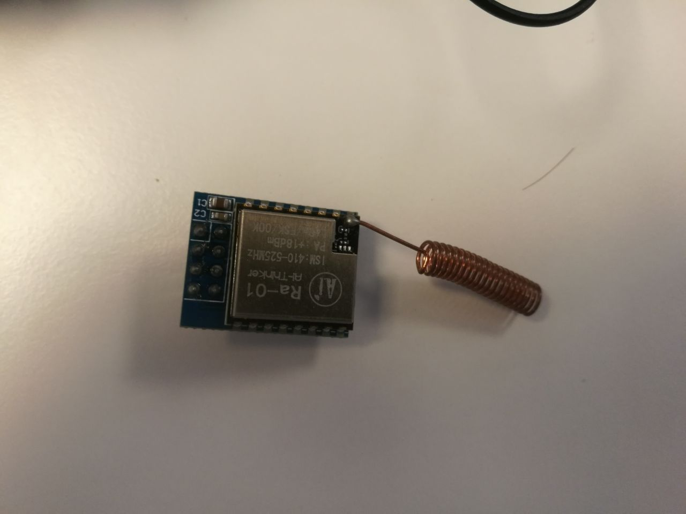
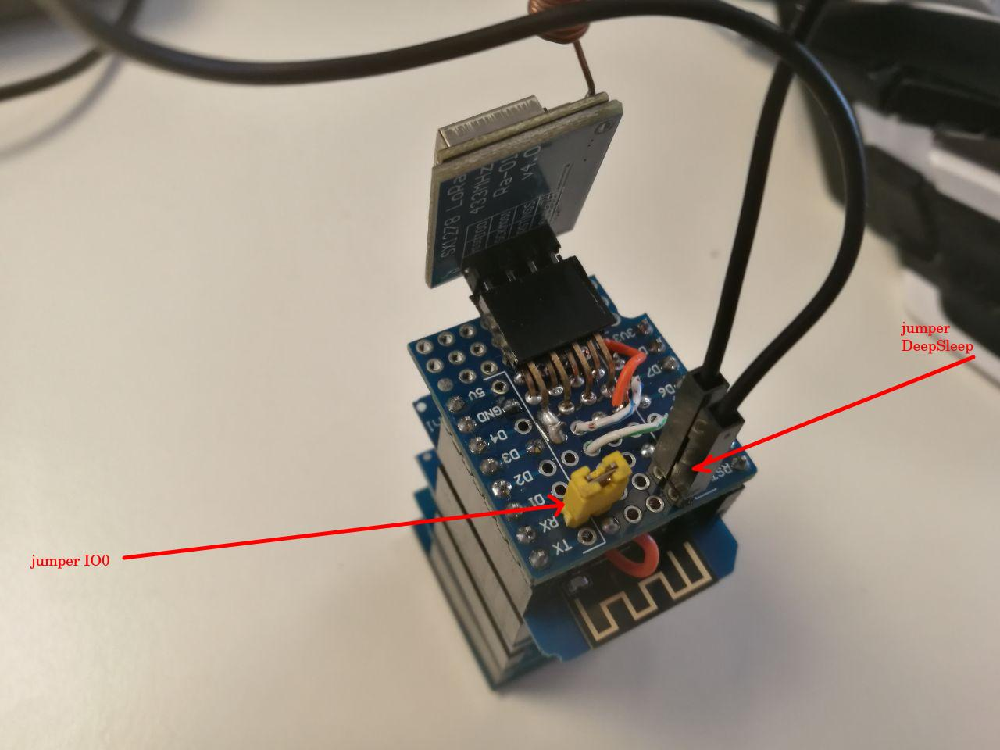
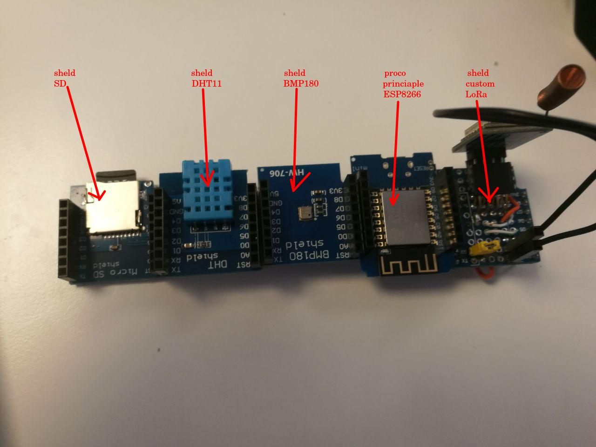
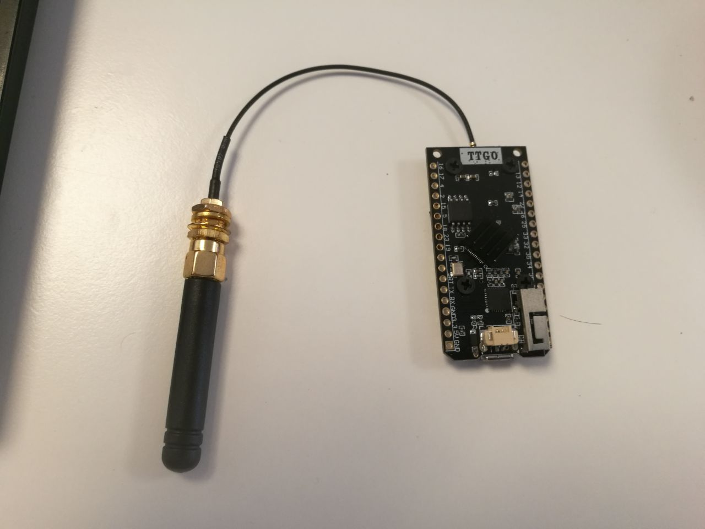
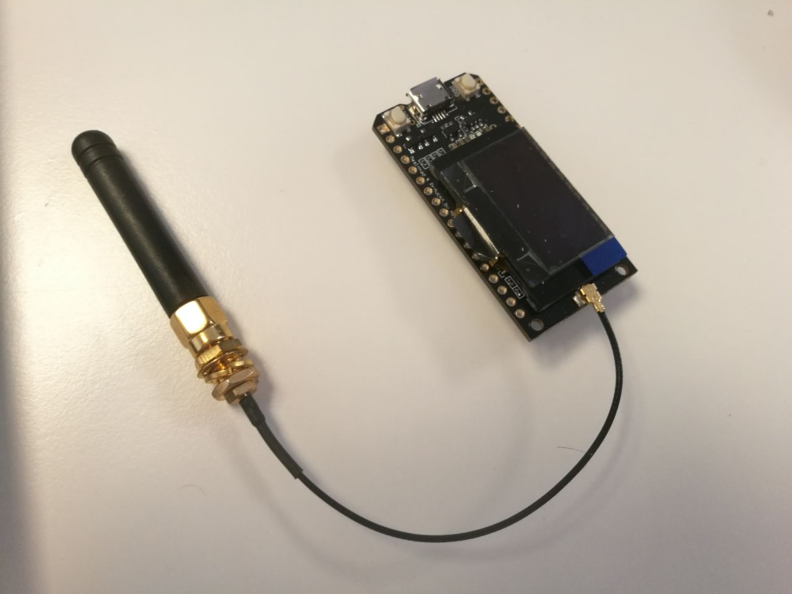
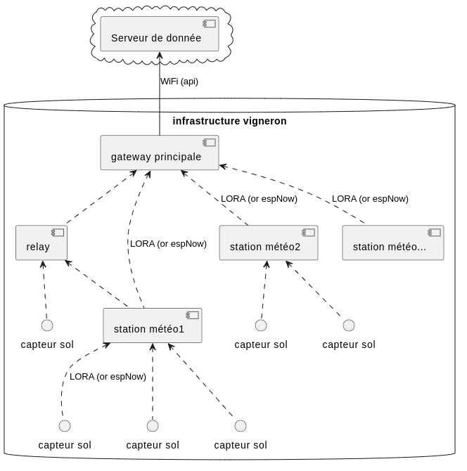

# Section IOT :

## POC :

original depot : [gitea](https://git.lab-ouest.org/Epitech/T-MAJ-800_msc2024)

code compilé via [platformio](https://platformio.org/)

### Capteur :

- BMP180 (baromètre)

- DHT11 (humidité, température)

Communication LoRa (via lib [FDRS](https://github.com/timmbogner/Farm-Data-Relay-System))

Stockage des donnée sur carte SD

Prise de mesure toute les 10 seconds avec deepSleep entre chaque mesure

Schémas de câblage sous [kicad 7.0](https://www.kicad.org/)

pour la programmation les 2 jumper doivent être retiré

- le jumper IO0 sert a notifier l'esp que l'émeteur lora a finit son envoie ou a reçus une nouvelle trame. il rentre en conflit lors de la programation car il est relier sur la pin RX de l'esp qui sert a la réception du nouveau code
- le jumper Deep Sleep sert a réveiller l'esp du sommeil profon se mode de l'esp l'étein completement a l'exeption d'un timer qui met la pin D0 a haut quand il est terminé se signial est donc envoyer a la pin reset pour reboot l'esp se qui le reveil et relance son programme. il rentre en conflit lors de la programation car bloque le bootloader se qui enpèche la programmation.

### Gateway :

Carte original : [TTGO LoRa32 SX1276 OLED](https://fr.aliexpress.com/item/4001275174741.html)

Communication LoRa (via lib [FDRS](https://github.com/timmbogner/Farm-Data-Relay-System))

Envoi des données sur api (WIP) et sur le terminal serie

