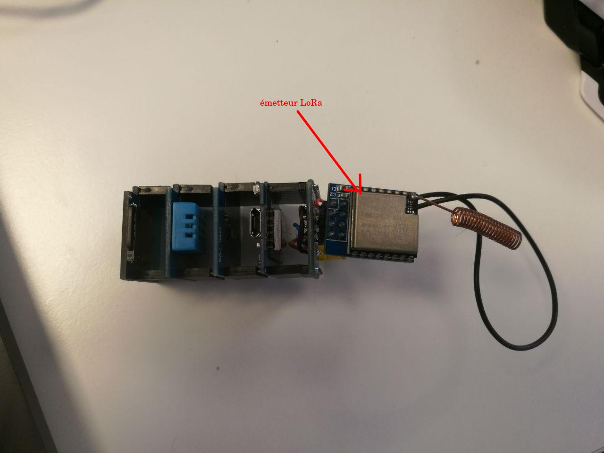

# Section IOT :

## POC :

Dépôt original : [gitea](https://git.lab-ouest.org/Epitech/T-MAJ-800_msc2024)

Code compilé via : [platformio](https://platformio.org/)

### Capteur :

- BMP180 (baromètre)

- DHT11 (humidité, température)

Communication LoRa (via lib [FDRS](https://github.com/timmbogner/Farm-Data-Relay-System))

Stockage des données sur carte SD

Prise de mesure toute les 10 seconds avec DeepSleep entre chaque mesure

Schémas de câblage sous [kicad 7.0](https://www.kicad.org/)

Pour la programmation les 2 jumper doivent être retiré

- Le jumper IO0 sert à notifier l'ESP que l'émetteur LoRa a fini son envoie ou a reçu une nouvelle trame. Il rentre en conflit lors de la programmation, car il est relié sur la pin RX de l'ESP qui sert à la réception du nouveau code
- Le jumper Deep Sleep sert à réveiller l'ESP du sommeil profond. Ce mode de l'ESP l'éteint complètement a l'exception d'un Timer qui met la pin D0 à haut quand il est terminé. Ce signal est donc envoyé à la pin reset pour reboot l'ESP ce qui le réveille et relance son programme. Il rentre en conflit lors de la programmation, car bloque le bootloader ce qui empêche la programmation.

### Gateway :

Carte originale : [TTGO LoRa32 SX1276 OLED](https://fr.aliexpress.com/item/4001275174741.html)

Communication LoRa (via lib [FDRS](https://github.com/timmbogner/Farm-Data-Relay-System))

Envoi des données sur api (WIP) et sur le terminal série

# archi global :
L'architecture globale du système est un réseau en étoile, c'est-à-dire que chaque capteur et chaque gatway a un parent auquel il doit envoyer les données

Exemple d'archi :

- Toutes les communications en pointillé peuvent être fait en LoRa ou avec ESPnow suivant la distance (ESPnow est une sorte de wifi lite en P2P créé par expressif pour communiquer entre ESP)

- EspNow sera choisi pour les petites distance (-70m) car meilleure bande passante et intégrée à l'ESP (donc pas besoins de module LoRa)

# shéma de cablage :

